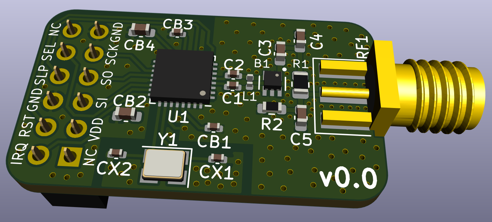

AT86RF233 Breakout
==================

This Repository contains an AT86RF233 breakout board that uses the basic
application schematic given in Section 5.1 "Basic Application Schematic" on
page 15 of the AT86RF233 datasheet (07/2014), with two differences:

1. The optional clock output is omitted
2. The 2.4 gigahertz antenna circuit from the [AT86RF215-XPRO](https://static5.arrow.com/pdfs/2015/6/30/10/21/54/282/atm_/manual/251atreb215-xpro_design_documentation.pdf)
   is used instead the on given in the AT86RF233 basic application schematic.
   The shielding used in the AT86RF215-XPRO is omitted.

This board is intentionally pin compatible with the openlabs.co RPI 802.15.4
radio - but not based on their design.

WARNING
=======

1. It is highly recommended to not order PCBs based on this design as of now.
   This design has never been tested.
2. There is absolutely no warranty.
3. The AT86RF233 chip, the 2 x 6 female pin header, and the SMA connector are
   note included in the generated BOM an need to be hand soldered.
